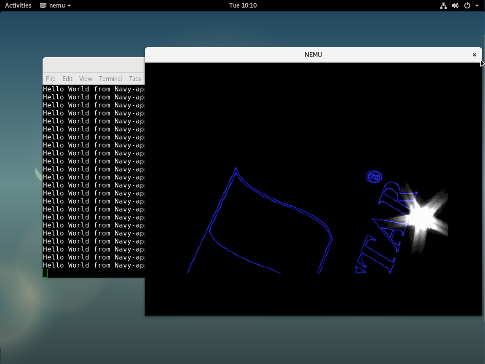
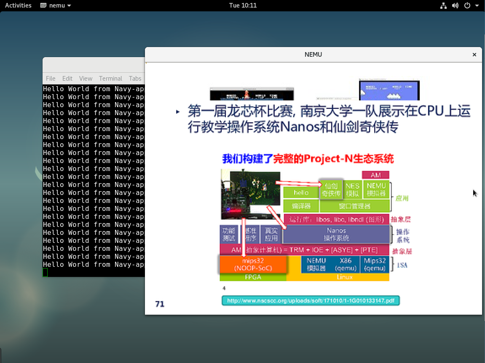
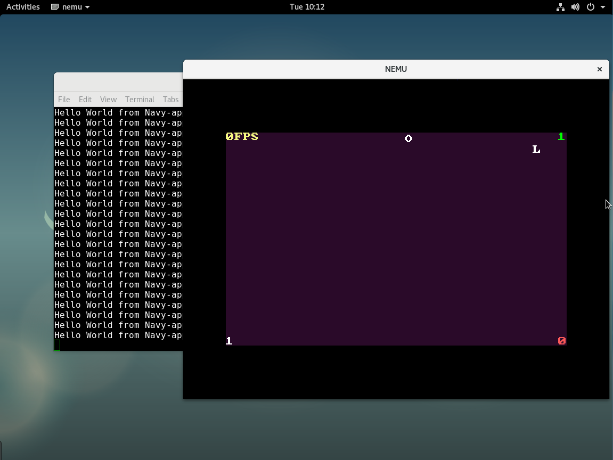

# NJU ICS2018 Programming Assignment

- Framework Codes: [NJU-ProjectN](https://github.com/NJU-ProjectN)
- Lecture Notes: [ICS-PA 2018](https://nju-ics.gitbooks.io/ics2018-programming-assignment/)
- Implementor: StardustDL
- Updated Time: 2018/12/25

This are the sources code of my programming assignment of ICS2018 courses. It contains ALL contents from PA1 to PA4.

- NEMU
- Nexus-AM (x86-nemu, x86-navy, native)
- Nanos-lite
- Navy-apps

The core of this project is **Abstract Machine**.

**AM = TRM + IOE + CTE + VME + MPE**

- TRM Turing Machine
- IOE I/O Extension
- CTE Context Extension
- VME Virtual Memory Extension
- MPE Multi-Processor Extension

The final architecture is

|Type|Item|
|-|-|
|Hardware (CPU and devices)|NEMU|
|Abstract Machine|x86-nemu-am|
|Libs on AM|klib|
|OS|Nanos-lite|
|Libs on OS|libc, libndl, libos|
|Virtual Machine|x86-navy-am|
|Apps on VM|typing-am,...|

# Run

## Environment

1. Use Debian 9 for basic OS
2. Install and update tools

```sh
apt update

apt install build-essential    # build-essential packages, include binary utilities, gcc, make, and so on
apt install man                # on-line reference manual
apt install gcc-doc            # manual for GCC
apt install gdb                # GNU debugger
apt install git                # reversion control system
apt install libreadline-dev    # a library to use compile the project later
apt install libsdl2-dev        # a library to use compile the project later
apt install qemu-system-x86    # QEMU
```

## NEMU

Enter `nemu/` directory, and use these commands:

```sh
# Compile
make

# Clean
make clean

# Run
make run

# Debug with gdb
make gdb
```

To change running mode, add these codes in `nemu/include/common.h`

```c
#define DEBUG
#define DIFF_TEST
```

## AM

Use `__NATIVE_USE_KLIB__` in `nexus-am/libs/klib/include/klib.h` to enable klib on native-am.

### CPU Tests

Enter `nexus-am/tests/cputest/` directory, and use these commands:

```sh
# Run dummy on x86-nemu
make ARCH=x86-nemu ALL=dummy run

# Run dummy on native
make ARCH=native ALL=dummy run
```

To run all tests, enter `nemu/` and use this:

```sh
bash runall.sh
```

### Device Tests

```sh
# Serial port
cd nexus-am/apps/hello/
make ARCH=x86-nemu run

# Timer
cd nexus-am/tests/timetest/
make ARCH=x86-nemu run

# Keyboard
cd nexus-am/tests/keytest/
make ARCH=x86-nemu run

# VGA
cd nexus-am/tests/videotest/
make ARCH=x86-nemu run
```

### Benchmarks

Disable `DEBUG` and `DIFF_TEST`, and enter `nexus-am/apps/` directory, then use these commands:

```sh
cd dhrystone
make ARCG=x86-nemu run

cd coremark
make ARCG=x86-nemu run

cd microbench
make ARCG=x86-nemu run
# Use TEST test cases
make INPUT=TEST
make ARCG=x86-nemu run
```

### AM-Apps

```sh
# Slider
cd nexus-am/apps/slider/
make ARCH=x86-nemu run

# Typing game
cd nexus-am/apps/typing/
make ARCH=x86-nemu run
```

## Nanos-lite

Enter `nanos-lite/` directory. Every time you change target AM, you need to update ramdisk first.

```sh
# Update ramdisk
make ARCH=x86-nemu update
make ARCH=native update

# Run
make ARCH=x86-nemu run
make ARCH=native run
```

**Attention**: To run PAL, it needs game data from course website.

### Tests

Load one of these apps when Nanos-lite started. (At `nanos-lite/src/proc.c`). Their source codes are in `navy-apps/test`.

```
/bin/bmp
/bin/dummy
/bin/events
/bin/hello
/bin/text
```

### Final

```sh
cd nanos-lite
make ARCH=x86-nemu update
make ARCH-x86-nemu run
```

It load `/bin/hello`, `/bin/pal`, `/bin/slider-am`, `/bin/typing-am`. You can press `F1`, `F2`, `F3` to change the foreground app.



